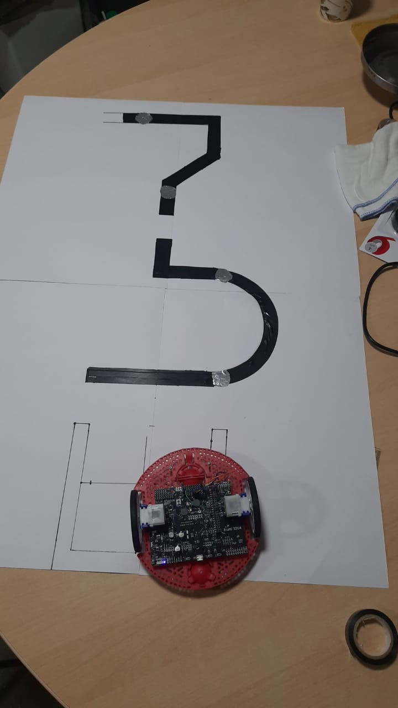
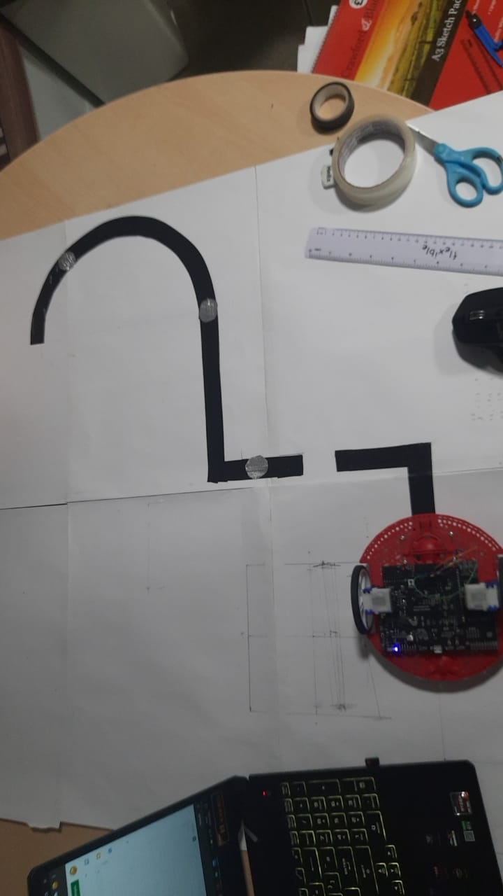
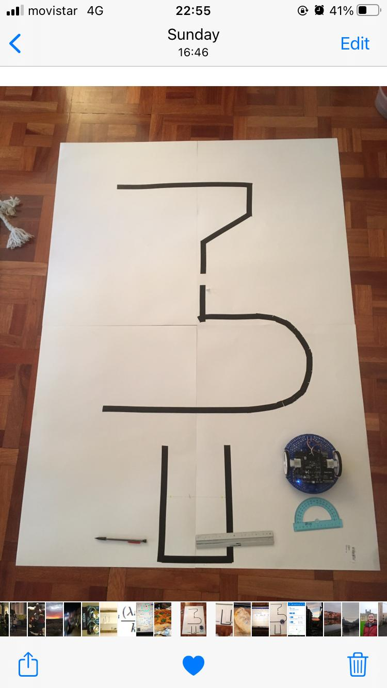
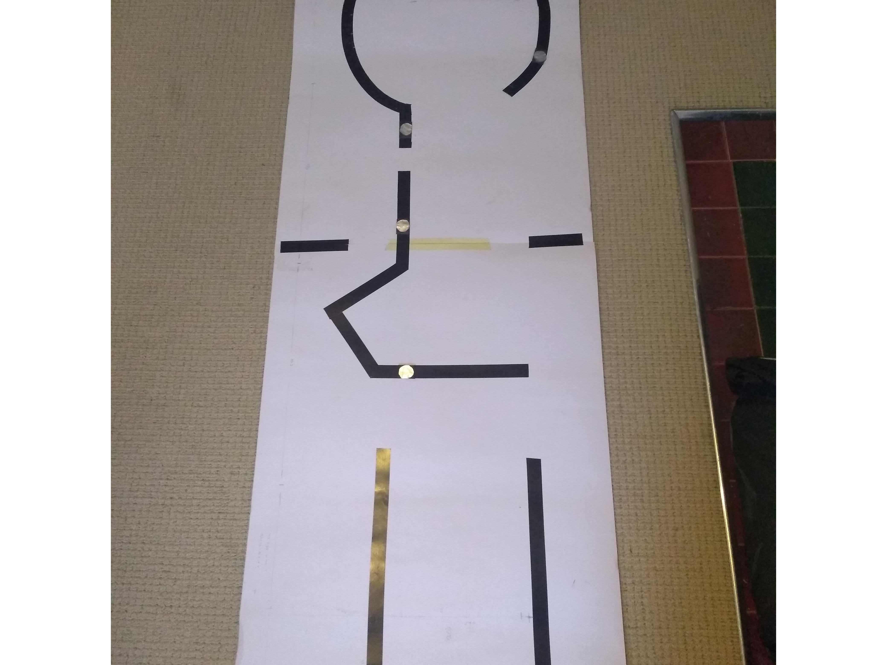
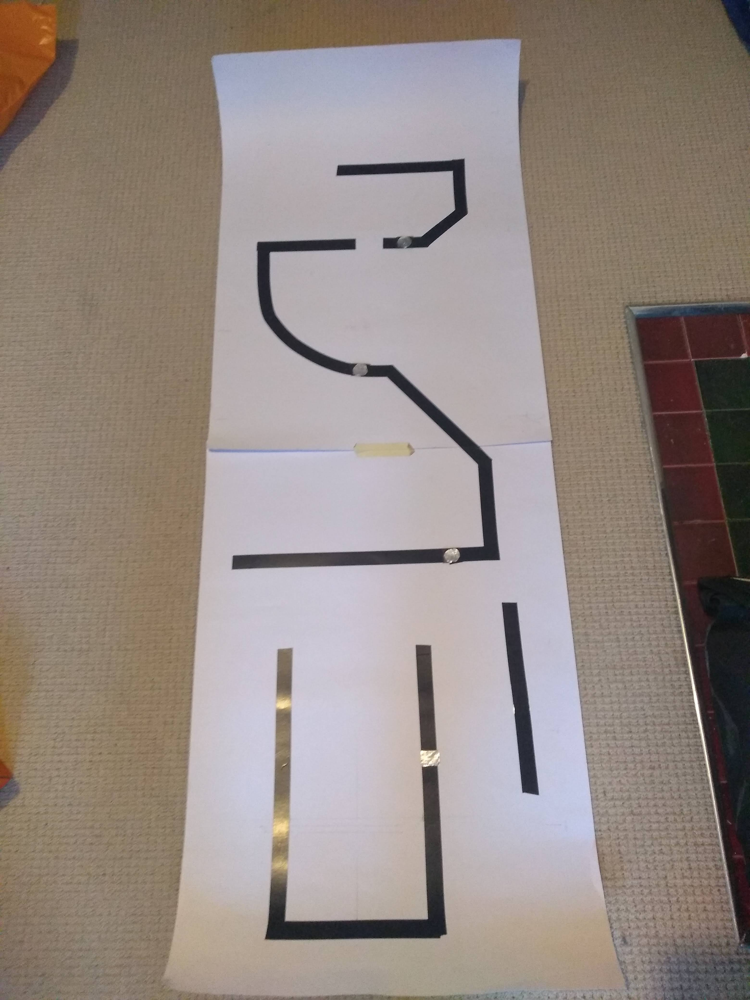

# Dynamic-Recalibration-of-the-Odometry
Code for EMATM0054 assignment

Three flavors available:

 1.  DynamicRecalibration: Moves along a track with nodes until finding more than one, and performs recalibration procedure on previous node.
 2.  No_calibration: Mimics movement of option 1 without recalibration
 3.  Ignore_nodes: "Baseline code". Will ignore nodes on track. Works on regular tracks too!

# Courses Tested

| Course 1  | Course 2            | Course 3  |
| ------------- |-------------| -----|
|       |  |  |
| Course 4  | Course 5            | Course 6   |
|       |  | -M.I.A.- |

